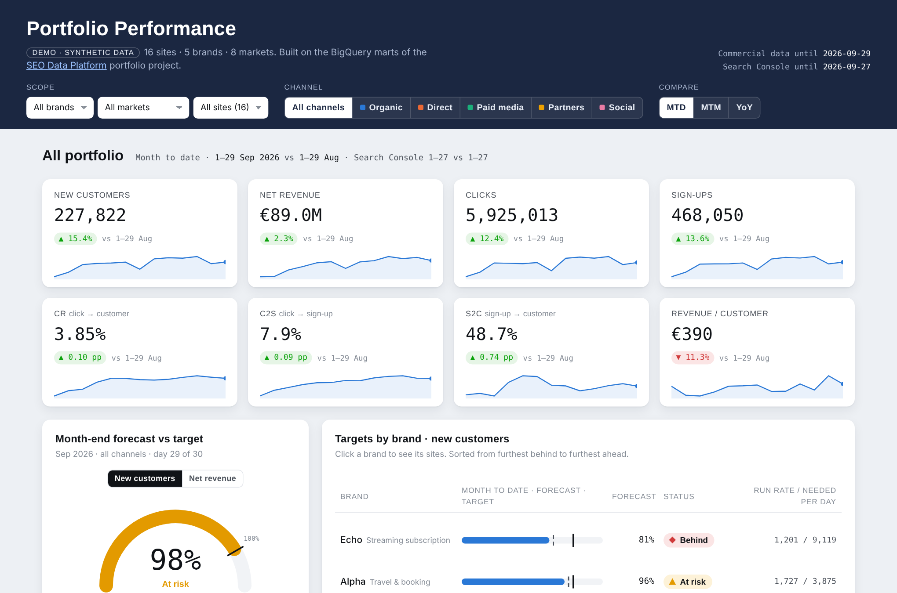

# SEO Data Platform


- **What:** a single source of truth for multi-site SEO reporting, built on synthetic data.
- **Stack:** Python · SQL · BigQuery · Snowflake · GSC / GA4 / PageSpeed APIs · rank tracker · Looker Studio
- **Run:** `python data_generator/generate.py && python scripts/run_local.py && python tests/test_marts.py`

**[Live dashboard demo →](https://victoriakutsai-cmd.github.io/seo-data-platform/)**

[](https://victoriakutsai-cmd.github.io/seo-data-platform/)

---

This repository is a portfolio project built on fully synthetic data. It shows how I approach a single source of truth for multi-site SEO reporting: raw → staging → marts in BigQuery, with Snowflake, GSC, GA4 and PSI as sources. Brands, domains, volumes and metrics are fictional. The design is generic and written from scratch for this repository.

## What it shows

- **One model, every report.** Commercial data, Search Console, GA4, targets, keyword rankings, link building and technical health (Core Web Vitals, indexation, 4xx/5xx errors, uptime) joined per site and day, so daily, weekly, monthly and portfolio reports all read the same tables.
- **Targets top-down.** Targets per site, month and channel roll up to brand and portfolio: achieved %, left to target, run rate, pace needed per day, month-end forecast and an On track / At risk / Behind status.
- **One funnel for every channel.** Organic, Direct, Paid media, Partners and Social share the same metrics: clicks, sign-ups, new customers, net revenue and the conversion rates C2S, S2C and CR.
- **MTD, MTM and YoY done right.** MTD compares the same days of the previous month, with a separate window per source, because Search Console lags behind commercial data. Every report prints the dates it compares.
- **SEO depth.** Brand vs non-brand clicks and non-brand traffic value, keyword position distribution (1–3, 4–10, 11–20, 21–100), and a 0–100 technical health score per site.
- **Deviation-first dashboard.** Portfolio → brand → market → site drill-down with a channel filter, biggest movers and a "needs attention" list.
- **Tested SQL.** The BigQuery SQL runs locally on SQLite, and `tests/test_marts.py` checks the marts against independent pandas calculations on the raw data.

## Quick start

```bash
pip install -r requirements.txt          # requirements-examples.txt only for examples/
python data_generator/generate.py        # 16 fictional sites, Jul 2023 – Sep 2026 -> data/*.csv
python scripts/run_local.py              # runs sql/01_staging + sql/02_marts on SQLite -> seo_platform.db
python tests/test_marts.py               # 10 checks: marts vs pandas, MTD windows, targets, brand split, keywords, date logic
```

On BigQuery (free sandbox): `bash scripts/load_demo_to_bigquery.sh <your-project-id>`, then connect Looker Studio to the `mart_*` tables.

## Repository

```
data_generator/   synthetic data
sql/              BigQuery SQL: 00_raw (DDL) -> 01_staging -> 02_marts
scripts/          local runner, BigQuery loader, dashboard build
tests/            checks of the marts against pandas (run by GitHub Actions on every push)
dashboard/        dashboard template (built to docs/index.html)
examples/         illustrative API / export snippets, not executed
docs/             data model, metrics, Looker Studio guide, live demo page
```

## Limitations

- **Synthetic data.** Trends, seasonality and events are modelled, not observed. There is no multi-touch attribution: each new customer belongs to one channel.
- **Local runner, not BigQuery.** CI runs the SQL on SQLite with a small translation layer for the BigQuery functions used. It is not a full dialect translation, and BigQuery itself is not exercised in CI.
- **Examples are not executed.** The API and export code in `examples/` is illustrative and has no tests.
- **Brand split is regex-based.** Anonymized Search Console queries count as non-brand, which slightly understates brand traffic.
- **Linear pacing.** The run-rate forecast assumes the rest of the month looks like the average day so far and ignores weekday patterns.
- **Static dashboard.** The demo page is a snapshot of the marts, not a live connection.

## What I'd do next

- Move the SQL to **dbt** with schema tests, documentation and incremental models.
- Run the marts against the **BigQuery sandbox** in CI (or transpile with sqlglot) instead of SQLite only.
- **Weekday-weighted forecast** for target pacing.
- **Anomaly detection** (seasonal decomposition or z-scores) to drive the "needs attention" list instead of fixed thresholds.
- Add **AI search visibility** (AI Overviews and LLM citations) as a source next to Search Console.
- Publish the live **Looker Studio** version on top of the BigQuery marts.

## Docs

- [Data model and business logic](docs/data_model.md)
- [Metric definitions](docs/metrics.md)
- [Looker Studio build guide](docs/looker_studio.md)

---

**Viktoriia Kutsai** · SEO Data Analyst · [LinkedIn](https://www.linkedin.com/in/viktoriia-kutsai-8ab062145/) · MIT License
