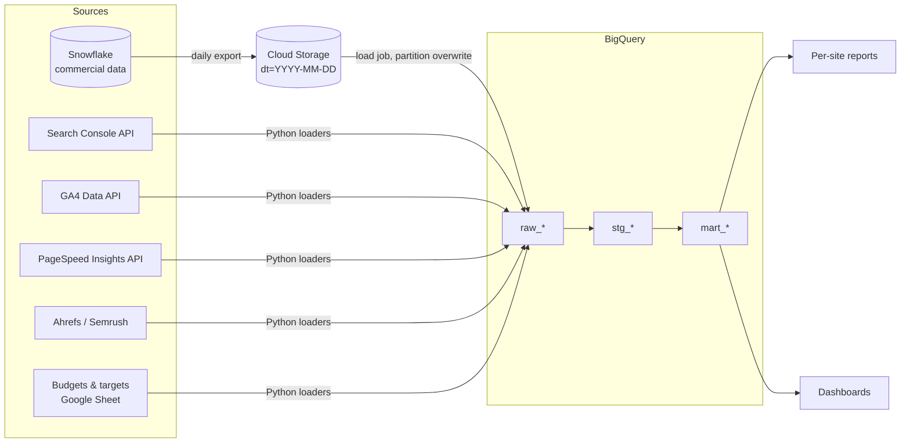

# Data model and business logic

## Flow



## Layers

| Layer | Tables | Purpose |
|---|---|---|
| **raw** | `raw_snowflake_commercial_daily`, `raw_gsc_site_daily` (brand / non-brand split), `raw_gsc_keyword_daily`, `raw_rank_tracker_weekly`, `raw_ga4_channel_daily`, `raw_targets_monthly` (site × month × channel), `raw_budgets_monthly`, `raw_links_monthly`, `raw_psi_cwv_weekly`, `raw_site_audit_weekly`, `dim_site`, `cfg_brand_terms`, `cfg_tracked_keywords` | Landed as-is; partitioned by date, clustered by site |
| **staging** | `stg_commercial_daily`, `stg_gsc_site_daily`, `stg_gsc_keyword_daily`, `stg_ga4_channel_daily`, `stg_cwv_weekly`, `stg_site_audit_weekly` | Typing and cleaning; GA4 channel groups mapped to the commercial channel names; GSC position converted from the zero-based bulk-export sum; CWV pass/fail on Google thresholds |
| **marts** | below | One table per reporting need |

| Mart | Grain | Used for |
|---|---|---|
| `mart_site_daily` | site × day × channel | Click → sign-up → new customer funnel, GA4 sessions, GSC |
| `mart_site_weekly` | site × ISO week × channel | Weekly view; WoW only for complete weeks |
| `mart_site_monthly` | site × month | New customers by channel, target achievement, net revenue, brand / non-brand clicks and CTR, non-brand traffic value, MoM, YoY |
| `mart_mtd_comparison` | site | MTD vs the same days of the previous month, per-source windows |
| `mart_target_pacing` | site × channel, current month | Achieved %, remaining, run rate, month-end forecast, pace needed per day, status; sums up to brand / portfolio |
| `mart_portfolio_monthly_report` | site × month | Transactions, revenue, LTV proxy, link budget usage, toxicity, CWV |
| `mart_keyword_rankings` | site × keyword × month | Priority and brand keyword positions from GSC, Top-10 flag |
| `mart_keyword_positions` | site × month × keyword group | Tracked keywords in positions 1–3, 4–10, 11–20, 21–100, not ranking |
| `mart_technical_health` | site × week | CWV, indexation rate, 4xx / 5xx errors, broken links, uptime, 0–100 health score |

## Business logic

**MTD with per-source windows** ([`04_mart_mtd_comparison.sql`](../sql/02_marts/04_mart_mtd_comparison.sql)).
Commercial data is complete to D-1, Search Console to about D-3, so each source gets its own window and a printed label:

```
commercial_period:  1 Sep - 29 Sep 2026 vs 1 Aug - 29 Aug 2026
gsc_period:         1 Sep - 27 Sep 2026 vs 1 Aug - 27 Aug 2026
```

`DATE_SUB(date, INTERVAL 1 MONTH)` clamps to month end (31 Mar → 28 Feb). On the first days of a month the two sources can sit in different months (commercial already in October, GSC still in September); the labels make that visible.

**Brand vs non-brand.** GSC queries are matched against each site's brand regex (`cfg_brand_terms`); anonymized queries count as non-brand. Brand clicks show demand for the brand, non-brand clicks show what SEO itself brings. Non-brand traffic value = non-brand clicks × the site's average CPC, i.e. what that traffic would cost in paid search.

**Target pacing** ([`05_mart_target_pacing.sql`](../sql/02_marts/05_mart_target_pacing.sql)).
Targets are set per site, month and channel (a YoY growth plan in the demo data). Run rate = MTD ÷ days elapsed; forecast = run rate × days in month; needed per day = remaining ÷ days left. Status: On track ≥ 100% of target, At risk ≥ 90%, Behind below 90%. Brand and portfolio views sum targets and actuals first, then recompute the ratios.

**Technical health score** ([`08_mart_technical_health.sql`](../sql/02_marts/08_mart_technical_health.sql)).
30 × Core Web Vitals pass (mobile) + 30 × indexation rate + 25 × error score (0 errors per 1k pages = 1, 20+ = 0) + 15 × uptime score (100% = 1, 99.0% or lower = 0).

**Keyword positions** ([`09_mart_keyword_positions.sql`](../sql/02_marts/09_mart_keyword_positions.sql)).
The last rank-tracker check of each month, bucketed into 1–3, 4–10, 11–20, 21–100 and not ranking, per keyword group (brand, priority, long tail).

**Idempotent loads.** Loaders replace whole date partitions, so reruns and backfills never duplicate rows. GSC re-pulls the last 5 days to pick up late data.

**Google's `&num=100` removal (Sep 2025).** GSC impressions dropped and average position "improved" while clicks did not change. The synthetic data reproduces this so dashboards can annotate it instead of reporting a fake decline.

**Synthetic dynamics.** Each site's brand and non-brand demand, every other channel and the conversion rates follow their own trend with uneven months (month-level shocks plus a slow random walk), seasonality and weekday patterns. The generator also adds events (core update gains and losses, a site migration with indexation loss, a 5xx server incident, paid budget cuts, a lost partner) so alerts and movers have something to find.

## Local runner

`scripts/run_local.py` loads the CSVs into SQLite and runs the same SQL files. It translates the few BigQuery-specific functions used (`DATE_TRUNC`, `DATE_SUB`, `DATE_ADD`, `DATE_DIFF`, `LAST_DAY`, `FORMAT_DATE`, `SAFE_DIVIDE`, `GREATEST`). `tests/test_marts.py` then recomputes key outputs from the raw CSVs with pandas and compares them.
